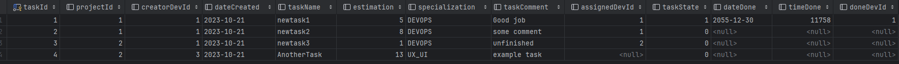
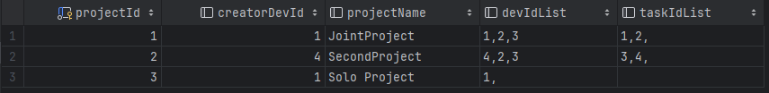
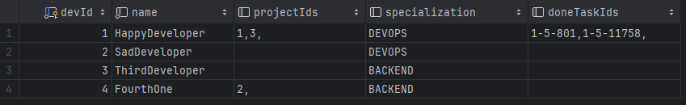
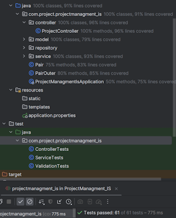
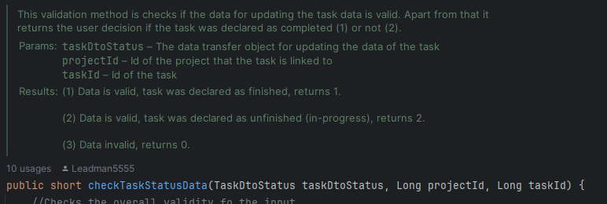

# BACKEND PROJECT

## Kilka słów o mnie

### Powtórka z formularza i kierunek:
Imię i nazwisko: Ignacy Smoliński

E-mail: ignacy.smolinski@gmail.com

Wydział: W4N - Wydział Informatyki i Telekomunikacji

Rok: 1, semestr 1

Kierunek: Informatyka Stosowana

### A teraz trochę więcej:
Przed rozpoczęciem studiów miałem styczność jedynie z C++, w którym pisałem maturę z informatyki, oraz z programowaniem algorytmicznym. Pierwszy program w Java z użyciem klas napisałem niecały tydzień przed rozpoczęciem studiów, a o API czy zasadach REST dowiedziałem się dopiero po przeczytaniu zadania rekrutacyjnego około 13 października.

Mocno zaangażowałem się w zadanie rekrutacyjne, stopniowo poznając Spring Boot, requesty w HTML, współpracę z zewnętrzną bazą danych (MySQL), a pod sam koniec pisanie testów jednostkowych i pierwszej w życiu dokumentacji. Można więc śmiało powiedzieć, że początkowo nie wiedziałem na ten temtat nic, a jednak po niecałym miesiącu prawie codziennej pracy nad projektem, czuję się w komfortowo zarówno w architekurze API, jak i w samej Javie. Tematyka ta mnie fascynuje i bardzo szybko się uczę, dlatego chciałbym dołączyć do koła już na pierwszym roku.

## O projekcie

### Ogólna idea

Do bazy danych można dodawać developerów, projekty i zadania. Każdy projekt ma trzy główne pola: developera, który go stworzył, drużynę developerów, którzy nad nim pracują i są do niego przypisani na etapie tworzenia projektu, oraz listę przypisanych zadań. Zadania można przypisywać (a później edytować) do dowolnego projektu, a do każdego zadania można przypisać (a później zmienić) odpowiedniego developera, który się nim zajmuje i może je ukończyć.

### Spełnione wymagania

Projekt spełnia wszystkie wymagania z Waszej listy, łącznie z "Nice to have" - testami jednostkowymi oraz dokumentacją. W projektcie są również zaimplementowane metody obsługujące dodatkowe requesty nieopisane w wymaganiach czy też dodatkowe pola dla modeli. Całość jest napisana w Javie z użyciem Spring Boot, a zewnętrzną bazą danych jest MySQL. Requesty testowałem przy użyciu Postman'a i testów jednostkowych. 

### Baza danych

Projekt korzysta z MySQl, a dokładniej z jednej bazy danych posiadającej trzy tabele: Developer, Project i Task. Ten kawałek kodu umożliwia stworzenie odpowiednich tabel z pasującymi nazwami pól, wymaganymi do odpowiedniego działania programu:
```SQL
CREATE DATABASE restapi;
USE restapi;
CREATE TABLE Developer (
    devId int NOT NULL AUTO_INCREMENT PRIMARY KEY,
    name varchar(20) NOT NULL,
    projectIds varchar(500),
    specialization varchar(10),
    doneTasksIds varchar(500)
);
CREATE TABLE Task (
    taskId INT AUTO_INCREMENT PRIMARY KEY NOT NULL,
    projectId INT,
    creatorDevId INT,
    dateCreated DATE,
    taskName VARCHAR(30),
    estimation INT,
    specialization VARCHAR(10),
    taskComment varchar(1000),
    assignedDevId INT,
    taskState BOOLEAN,
    dateDone DATE,
    timeDone INT,
    doneDevId INT
);
CREATE TABLE Project (
    projectId INT NOT NULL AUTO_INCREMENT PRIMARY KEY,
    creatorDevId INT,
    projectName VARCHAR(30),
    devIdList VARCHAR(500),
    taskIdList VARCHAR(500)
);
```
Reszta ustawień dotyczączych połączenia bazy danych znajduje się w tym [pliku](https://github.com/Leadman5555/MainVersion/blob/main/MainVersion/ProjectManagment_IS/src/main/resources/application.properties)

Przykładowy wygląd tabel:
<div align="center">



</div>

### Testy jednostkowe
Testy jednostkowe obejmują wszystkie istotne funkcjonalności i są podzielone na trzy grupy:
- Controller tests
- Service tests 
- Validation tests (testy części programu odpowiedzialnej za sprawdzanie poprawności danych)

Każdy test jest nazwany według schematu: nazwaTestowanejMetody_ShouldOpisOczekiwanegoWyniku_WhenOpisDanych

Line coverage:
<div align="center">

</div>

### Dokumentacja
Dokumentacja w projekcie jest pisana nad każdą metodą z osobna. Niektóre metody posiadają dodatkowe komentarze opisujące kod oprócz początkowej dokumentacji. Całość dokumentacji, komentarzy jak i nazwy wszystkich zmiennych czy pól w projekcie są w języku angielskim.

Przykładowa dokumentacja metody: 
<div align="center">

</div>


    
    
    
    
